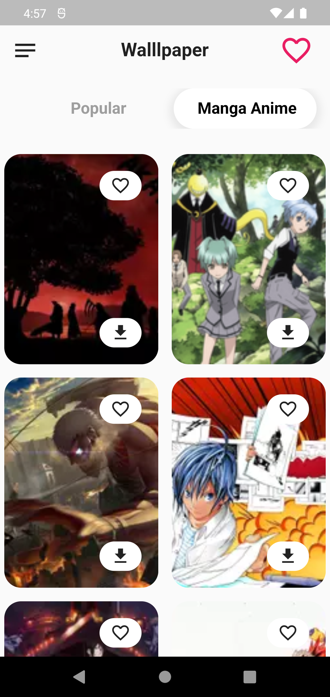

<!-- PROJECT LOGO -->
 

## **Wallpaper Station**
  

    Wallpaper station is android  app. this app help to get wallpaper
     
    

  
      

    <a href="https://github.com/RootHex200/Wallpaper_station/issues">Report Bug</a>
    ·
    <a href="https://github.com/RootHex200/Wallpaper_station/issues">Request Feature</a>
  

<!-- TABLE OF CONTENTS -->

  
Table of Contents

  <ol>
    <li>
      <a href="#about-the-project">About The Project</a>
      <ul>
        <li><a href="#features-with-snapshots">Features with Snapshots</a></li>
        <li><a href="#built-with">Built With</a></li>
      </ul>
    <li><a href="#roadmap">Roadmap</a></li>
   
  </ol>

<!-- ABOUT THE PROJECT -->
## About The Project

 
Wallpaper is andorid version app.This app help to get wallpaper easily.The app was made with Flutter as frontend technology and node js as a Backend Technology. This app help  those people who don't interest to visit website to download wallpaper.they can be use this app to download wallpaper

(<a href="#top">back to top</a>)

## Features with Snapshots
1. Show wallpaper All, Popular, Manga anime category.
   

snapshot

   
      

   

2. Download image
   

snapshot

     
   

3. Favourite image 
   

snapshot

   

   

## Built With 
#### Frontend Technology  
* [Flutter](https://flutter.dev/?gclsrc=ds&gclsrc=ds)  
Features and Plugins I've used: 
   - Dio
   - Flutter Riverpod
   - Flutter hook 
   - downloads_path_provider_28
   - flutter_staggered_grid_view
  
   
* Demo video link: https://drive.google.com/file/d/17cI3hvJ7SzdlNBaQqwVjz3HZQhPe4GiS/view?usp=sharing

(<a href="#top">back to top</a>)

## Prerequisites

######
* **Flutter**

  Flutter has a greate [documentation](https://docs.flutter.dev/get-started/install) for enviroment setup 

## Roadmap
#### Frontend
- [x] create three screen
    - [x] first 1 screen for 3 tab bar
    - [x] second screen for get full screen image
    - [x] third screen for favourite
- [x] first screen  call server by Futureprovider then get data and show in all,popular,manga anime tab bar
- [x] click image and get new screen for full image by parsing data in constructor
- [x] click favourite option to save wallpaper image in hive database
- [x] click download option to download image by dio
- [x] Go favourite page show favourite image data from hive database which data save by click favourite options
- [x] delete image in favourite page  from hive database by index value

    

(<a href="#top">back to top</a>)

>>>>>>> Stashed changes
